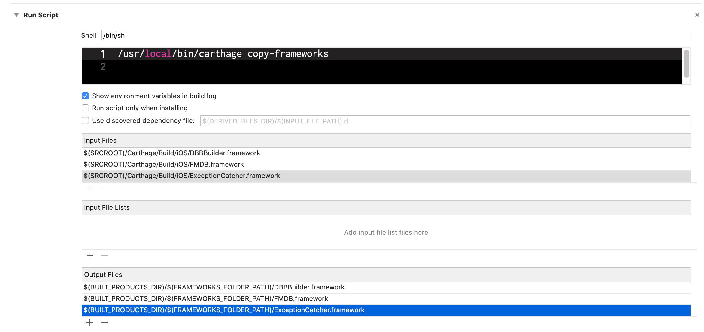
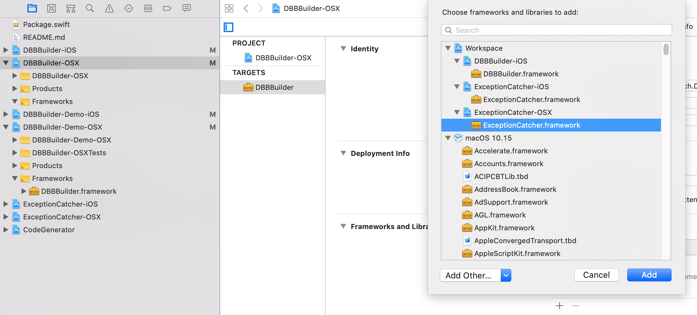
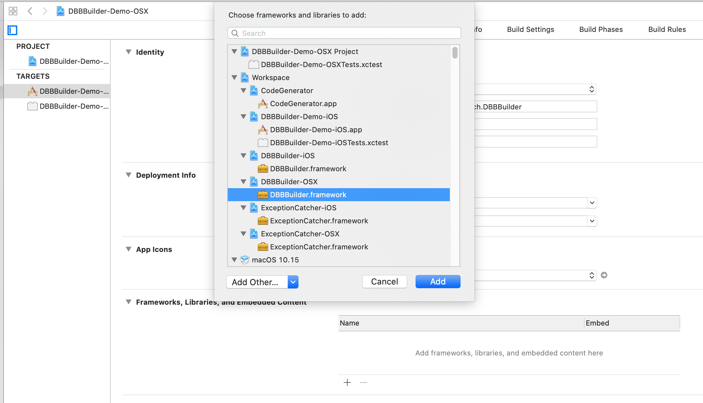

# DBBBuilder

### A framework for working in Swift with first-class objects persisted to SQLiite databases.


- Works in conjunction with the [FMDB](https://github.com/ccgus/fmdb) framework to allow developers to work with first-class objects
- Builds frameworks for iOS and Mac projects
- Generates and updates SQLite database files and tables automatically based on your class definitions
- Can be used with existing SQLite database files
- Install with Swift Package Manager or Carthage
- Swift 5
- Xcode 10.1 or higher

### Overview

DBBBuilder is a Swift project that makes it easy to work with first-class objects that are persisted to an SQLite database with the FMDB framework in your iOS or Mac projects.

DBBBuilder takes care of creating and updating the database file, including all tables and indexes if needed, at runtime, based on your class definitions and other configuration steps.

### Installation

#### Swift Package Manager
You can use Swift Package Manager to add DBBBuilder to your iOS, WatchOS and macOS projects. To do so, with your project open in Xcode, choose File>Swift Packages>Add Package Dependency... and enter `https://github.com/dennisbirch/dbbbuilder-swift` in the text box of the _Choose Package Respository_ dialog that appears. Then hit the _Next_ or _Finish_ button on this and all subsequent screens until you see that the DBBBuilder library has been added to your project.

#### Carthage

You can also add DBBBuilder to your Xcode project using the [Carthage](https://github.com/Carthage/Carthage) dependency manager.

Start by [installing Carthage](https://github.com/Carthage/Carthage#quick-start) on your Mac if necessary. Add a Cartfile to your project folder if necessary. Then add a dependency statement for DBBBuilder to your Cartfile:

`github "https://github.com/dennisbirch/dbbbuilder-swift/"`

In your terminal application, cd into your project directory and run Carthage update:

`carthage update`

Finally, add a Run Script step to your target's Build Phases section. Be sure to add the FMDB, DBBBuilder, and ExceptionCatcher frameworks to the Input and Output files sections.



You should now be able to begin using DBBBuilder in your Xcode project.

### Setup for building frameworks and running demos

The workspace in this repository includes demo projects and unit tests for iOS and macOS targets. You can examine the code in these projects to get guidance on using DBBBuilder. To run the projects and unit tests, you'll need to do some setup with Carthage, and with the Swift Package Manager if you want to build the framework target by itself.

#### Using Swift Package Manager (default implementation - requires Xcode 11.0 or higher):

(The following actions must be performed separately for either scheme you want to work with, i.e. `DBBBuilder-Demo-OSX` or `DBBBuilder-Demo-iOS`)

* Enable building the iOS or OSX framework you're interested in working with (__only required if you want to build the framework separately__):
    * Select `DBBBuilder-OSX` or `DBBBuilder-iOS` in the project navigator
    * On the General tab of the Project editor panel, add the ExceptionCatcher.framework in the `Frameworks and Libraries` section as displayed above
    * Add the FMDB package as described in the _Installation_ section above (but setting the URL to https://github.com/ccgus/fmdb)
* Run unit tests or project


#### Using Carthage:

* Clone the repo
* Install Carthage if necessary
* In your terminal app, cd into the dbbbuilder-swift directory
* Run 'carthage update'
* Open DBBBuilder-Swift.workspace in Xcode

(The following actions must be performed separately for either scheme you want to work with, i.e. `DBBBuilder-Demo-OSX` or `DBBBuilder-Demo-iOS`)

* Enable building the iOS or OSX framework you're interested in working with:
    * Select `DBBBuilder-OSX` or `DBBBuilder-iOS` in the project navigator
    * On the General tab of the Project editor panel, add the ExceptionCatcher.framework in the `Frameworks and Libraries` section

    
    
    * At this point you should be able to successfully build the selected framework
* Enable running the demo project:
    * In the Project navigator, select the corresponding demo project (i.e. `DBBBuilder-Demo-OSX` or `DBBBuilder-Demo-iOS`) 
    * Add the DBBBuilder.framework in the `Frameworks, Libraries and Embedded Content` section
     
    
* Uncomment the Run Script on the Build Phases tab of the selected target's Project editor panel by deleting the leading "#" character
* Select the appropriate `DBBBuilder-Demo-OSX` or `DBBBuilder-Demo-iOS` scheme from scheme selector and run the project or unit tests


### Usage

DBBBuilder has two main classes and some supporting types that you need to be concerned with to use it properly.

`DBBManager` is the class that holds a reference to the database file you're persisting data to. You can have more than one DBBManager instance in your project, but each one must be set up to work with a different file.

`DBBTableObject` is the parent class for each object you want to persist to the database.

Proper use of DBBBuilder requires setting up each DBBManager instance with the DBBTableObject subclass types it manages. You also need to configure the DBBManager with mapping for each DBBTableObject subclass, defining the properties that should be persisted to the database file and their types. You can optionally configure the DBBManager with indexing instructions for any DBBTableObject subclass to tell it which properties it should build indexes for.

#### DBBManager

__Initalizing:__ `init(databaseURL: URL)`

_databaseURL_: The URL for a database file. Be sure it points to a file and not to a directory.

__Configuring with table types:__ 

`public func addTableClasses(_ tableClasses: [DBBTableObject.Type])`

_tableClasses_: An array of DBBTableObject _types_.

After initializing a DBBManager instance, tell it what DBBTableObject subclasses it will include in its database table with this method.  For example:

```
let dbManager = DBBManager(databaseURL: dbFileURL)
// Person, Project and Meeting are DBBTableObject subclasses
let tableClasses = [Person.self, Project.self, Meeting.self] 
dbManager.addTableClasses(tableClasses)
```

__Defining subclass properties:__ `func addPersistenceMapping(_ contents: [String : DBBPropertyPersistence], for tableObject: DBBTableObject, indexer: DBBIndexer? = nil)`

_contents_: A [String : DBBPropertyPersistence] dictionary defining the name and type of each property in a DBBTableObject subclass that should be persisted to the database.

_tableObject_: A DBBTableObject subclass. If you call this method from a DBBSubclass's init method, you can provide _self_ as the parameter.

_indexer_: An optional argument that takes an instance of a `DBBIndexer` struct, with information on building indexes for properties belonging to this subclass. See the discussion of DBBIndexer [below](#dbbindexer). 

It is best practice to call this method in your DBBTableObject subclass instances' init methods. [See below.](#complete-init)

#### DBBTableObject

__Defining properties:__ Because DBBBuilder uses Key Value Observing to assign values from the database to DBBTableObject subclass instances, each of a DBBTableObject subclass's properties that you want to persist to the database must be marked with the `@objc` attribute.

For example:

```
class Project: DBBTableObject {
    @objc var name = ""
    @objc var code = ""
    @objc var startDate: Date?
    @objc var endDate: Date?
    @objc var budget: Float = 0
    @objc var meetings = [Meeting]()
    @objc var tags = [String]()
    @objc var subProject: Project?
    @objc var projectLead: Person?
```

__Initializing:__ `required init(dbManager: DBBManager)`

_dbManager_: The DBBManager instance managing the database file that this subclass's instances should be written to.

A DBBTableObject subclass must be initialized with this init method. 

As part of the initialization process, you should call DBBManager's addPersistenceMapping(_contents: tableObject: indexer:) method to configure the manager with the metadata it needs for writing subclass property values to the database file.

This method takes as its *contents* parameter, a [String : DBBPropertyPersistence] dictionary.
The String key is the case-sensitive name of the property. DBBProperty is a simple struct that defines a database column name and its type as one of a member of the DBBStorageType enum. This allows you to assign a custom name for a property in your class so that the property name and databse column name can differ if necessary. For example if you're working with a pre-existing table where you want the property name to be different from the column name already defined, you can use the DBBPropertyPeristence init method variation that accepts a column name to map the datatabase's column name to your object's property name.

A complete DBBTableObject subclass's init method might look like this: <a name="complete-init"> </a>

```
    required init(dbManager: DBBManager) {
        super.init(dbManager: dbManager)
        
        let index = DBBIndexer(columnNames: ["name"])
        let map: [String : DBBPropertyPersistence] = ["name" : DBBPropertyPersistence(type: .string, columnName: "itemName"),
                                                      "code" : DBBPropertyPersistence(type: .string),
                                                      "startDate" : DBBPropertyPersistence(type: .date),
                                                      "endDate" : DBBPropertyPersistence(type: .date),
                                                      "budget" : DBBPropertyPersistence(type: .float),
                                                      "meetings" : DBBPropertyPersistence(type: .dbbObjectArray(objectType: Meeting.self)),
                                                      "tags" : DBBPropertyPersistence(type: .stringArray),
                                                      "subProject" : DBBPropertyPersistence(type: .dbbObject(objectType: Project.self)),
                                                      "projectLead" : DBBPropertyPersistence(type: .dbbObject(objectType: Person.self))]
        dbManager.addPersistenceMapping(map, for: self, indexer: indexer)
    }
```

You can see more examples of DBBTableObject initialization in the demo projects included in the DBBBuilder workspace.

_Helper tool_: There is an Xcode project in the workspace named _CodeGenerator_ that can automatically generate much of the boilerplate for a DBBTableObject subclass, given the subclass name and a list of properties. See the README in its folder for usage directions.

_Adding indexes_: If you want to include an index for any column (i.e. property), create a DBBIndex instance with that property's name in the indexer's _columNames_ String array property, and include that as the optional __indexer__ argument in the addPersistenceMapping(_contents: table: indexer:) method call. You can add indexes for any property in a DBBTableObject subclass. If a property is defined as a DBBTableObject subclass or as an array, DBBBuilder stores data in a join table and automatically indexes that table.

__Additional properties__: DBBTableObject has two other properties you may want to take advantage of in different situations.

`attributesDictionary: [String : String]?`

An optional dictionary that lets you define attributes to apply to class properties. The dictionary's keys are property names, and values are attributes to their database columns, either NOT NULL or DISTINCT. See the section on [Helpers](#helpers) for more.
    
`isDirty`

A Boolean value you can set and read from your application code to use to determine whether an object's state is altered.

#### DBBPropertyPersistence

DBBPropertyPersistence is used as part of the process of initializing a DBBManager instance to define the properties that should be persisted to the database file. As explained above, it is best practice to add this meta-data as part of a DBBTableObject subclass's initialization process.

__initialization:__ `public init(type: DBBStorageType)`

_type_: A member of the DBBStorageType enum that defines the property's type. [See below.](#dbbstoragetype)

__Or:__ `public init(type: DBBStorageType, columnName: String)`

_type_: Same as above.

_columnName_: A String argument that defines an alternate name to use in the database file to define this property. This is useful if you're working with an existing database table and want or need to have a different name for a corresponding property.

#### DBBIndexer <a name="dbbindexer"> </a>

DBBIndexer is used to contain the names of all database columns that should be indexed for a table. You can also set the indexer's _unique_ property to true if the index should only work on unique values.

__initialization:__ `public init(columnsToIndex: [String], unique: Bool = false)`

_columnsToIndex_: A String array of names of properties that should be indexed in the database file.

_unique_: An optional Bool value telling DBBBuilder to create UNIQUE indexes. It is set to False by default.

#### DBBStorageType <a name="dbbstoragetype"> </a>

An enum that defines the types DBBBuilder can persist to the database file. You use these types to configure your DBBManager instance(s) with mapping that tells them what to persist to file and how to persist it.

- .bool - Boolean values
- .int - All Integer types
- .float - All floating point numbers
- .string - Strings
- .date - Dates
- .dbbObject - Any DBBTableObject subclass
- .boolArray - Array of Boolean values
- .intArray - Array of Integer types
- .floatArray - Array of floating point numbers
- .stringArray - Array of Strings
- .dateArray - Array of Dates
- .dbbObjectArray - Array of DBBTableObject subclass

The dbbObject and dbbObjectArray members take an `objectType` argument in their initializers. This is a specific subclass type.

See the [DBBTableObject discussion above](#complete-init) for an example of DBBStorageType usage.

#### Writing Objects To The Database

There are two ways of saving DBBTableObject subclass instances to the database, one at a time, or as an array of homogenous objects.

`public func saveToDB() -> Bool`

Saves a single instance to the database. This method returns a Boolean value indicating whether the save succeeded. In case of failure you can get an error message from the underlying database by calling the errorMessage function on your DBManager's instance. For example:

```
print(dbMgr.errorMessage())
```
<a name="save-object-arrays"> </a>
`public static func saveObjects(_ objects: [DBBTableObject], dbManager: DBBManager) -> Bool` 

A static method for saving an array of DBTableObject subclass instances to the database file.

_objects_: A homogenous array of DBBTableObject subclass types. If you pass in an array of different types, the method will abort before saving anything.
         
 _dbManager_: The DBBManager instance managing the database the object values should be saved to.
 
_Returns_: A Boolean indicating successful execution.

An example of using this method:

```
let people = [joe, mary, billy]
let success = Person.saveObjects(people, dbManager: mgr)
if success == false {
	print("Error saving person array: \(mgr.errorMessage())")
}
```

There are two additional public methods you can call from your application's DBBTableObject subclasses:

`public func performPreSaveActions()`

If you override this method, it will be called immediately before data is inserted into the database or the database is updated. You can perform whatever actions are necessary to prepare instances for saving in this method.

`public func performPostSaveActions()`

If you override this method, it will be called immediately after data is inserted into the database or the database is updated. You can perform whatever actions are necessary to continue after instances are persisted.

#### Retrieving Objects From the Database

There are several methods for retrieving objects from the database. All of them are static methods that should be called on your DBBTableObject subclass types. Each method returns either a single DBBTableObject instance or an array of them. As such you will need to cast them to their subclass type in order to use them in most cases. For example:

```
guard let projects = Project.allInstances(manager: manager) as? [Project] else {
    return
}
```

`public static func allInstances(manager: DBBManager) -> [DBBTableObject]`

A static method to retrieve all instances of a DBBTableObject subclass from the database.
 
_manager_: A DBBManager instance that owns the FMDB instance/SQLite file being read from.

_Returns_: An array of all instances of the subclass in the database, fully populated.

`public static func instancesWithOptions(_ options: DBBQueryOptions, manager: DBBManager, sparsePopulation: Bool = false) -> [DBBTableObject]?`

A static method to retrieve DBBTableObjects that meet defined criteria.

_options_: A DBBQueryOptions instance that defines characteristics of the DBBTableObjects you want to retrieve. See the section on _DBBQueryOptions_ [below](#dbbqueryoptions) for details.

_manager_: A DBBManager instance that owns the FMDB instance/SQLite file being read from.

_sparsePopulation_: An optional Boolean value indicating whether you would like returned objects to be populated only with their id and created and modified dates. The default value is False.

_Returns_: An optional array of instances that meet the parameters passed in as options.

__Note:__ You can query the database for objects that match the ID(s) of a property that is of type DBBTableObject. To do so, include a condition in the _options_ argument with the _name_ of the property and the ID number it should match. For example, if you have a Meeting DBBTableObject that has as a 'project' property, which is a Project DBBTableObject subclass, you could include a condition like "project = \(projectID)" (where 'projectID' is an Integer value). If the property is represented as an array of DBBTableObjects, you should use "IN" syntax: "project IN (\(idsArray))" (where 'idsArray' is an array of Integer values). 

See the _testMeeting_ method in the _MeetingTests.swift_ file for examples of these usages.

`public static func getInstancesFromQueue(withOptions options: DBBQueryOptions,
                                             manager: DBBManager,
                                             sparsePopulation: Bool = false,
                                             completion: ([DBBTableObject], NSError?) -> Void)`

A static method to get an array of DBBTableObjects that meet requested criteria in a completion handler.
                                             
_options_: A DBBQueryOptions instance that defines characteristics of the DBBTableObjects you want to retrieve. See the section on _DBBQueryOptions_ [below](#dbbqueryoptions) for details.

_manager_: A DBBManager instance that owns the FMDB instance/SQLite file being read from.

_sparsePopulation_: An optional Boolean value indicating whether you would like returned objects to be populated only with their id and created and modified dates. The default value is False.

_completion_: A closure that is called when the fetch is complete. At the calling site you'll get an array of DBBTableObject subclasses that meet your criteria, and an optional error, which if non-nil, provides information on the reason for the failure.

`public static func instanceWithIDNumber(_ id: Int64, manager: DBBManager, sparsePopulation: Bool = false) -> DBBTableObject?`

A static method to get a single DBBTableObject subclass instance matching the ID number passed in.

_id_: An Int64 value representing the id number for the instance you want to retrieve.

_manager_: A DBBManager instance that owns the FMDB instance/SQLite file being read from.

_sparsePopulation_: An optional Boolean value indicating whether you would like the returned object to be populated only with its id and created and modified dates. The default value is False.

_Returns_: An optional DBBTableObject instance whose id property matches the id value passed in.

`public static func instancesWithIDNumbers(_ ids: [Int64], manager: DBBManager) -> [DBBTableObject]`

A static method to get an array of DBBTableObject subclass instances matching the ID numbers passed in.

_ids_: An array of Int64 values representing the id numbers for the instances you want to retrieve.

_manager_: A DBBManager instance that owns the FMDB instance/SQLite file being read from.

_sparsePopulation_: An optional Boolean value indicating whether you would like returned objects to be populated only with their id and created and modified dates. The default value is False.

_Returns_: An array of DBBTableObject instance whose id properties match the id values passed in.

`public static func allInstanceIDs(manager: DBBManager) -> [Int64]`

A static method to retrieve the ids of all instances of a DBBTableObject subclass from the database. 

_manager_: A DBBManager instance that owns the FMDB instance/SQLite file being read from.

_Returns_: An array of Int64 values representing all the id values for the subclass you ran the request on.

#### Deleting from the database <a name="deleting"> </a>

There are three DBBTableObject static methods for deleting rows associated with object instances from their database tables. You call them on the DBBTableObject subclass type of the instance(s) you want to delete.

`public static func deleteInstance(_ instance: DBBTableObject, manager: DBBManager) -> Bool`

Deletes a single instance from the database. This method returns a Boolean value indicating whether the deletion succeeded. 

_instance_: The instance of the DBBTableObject subclass type you want to delete.
         
 _dbManager_: The DBBManager instance managing the database the object values should be saved to.
 
_Returns_: A Boolean indicating successful execution.

In case of failure you can get an error message from the underlying database by calling the errorMessage function on your DBManager's instance. For example:

```
print(dbMgr.errorMessage())
```
`public static func deleteMultipleInstances(_ instances: [DBBTableObject], manager: DBBManager) -> Bool` 

A static method for deleting an array of DBTableObject subclass instances from the database file.

_instances_: A homogenous array of instances of the DBBTableObject subclass type you want to delete.
         
 _dbManager_: The DBBManager instance managing the database the object values should be saved to.
 
_Returns_: A Boolean indicating successful execution.

`public static func deleteAllInstances(manager: DBBManager) -> Bool`

A static method for deleting all instances of a DBBTableObject type.

 _dbManager_: The DBBManager instance managing the database the object values should be saved to.
 
_Returns_: A Boolean indicating successful execution.

#### DBBQueryOptions <a name="dbbqueryoptions"> </a>

When retrieving objects from the database, some methods take a DBBQueryOptions argument to determine which and how objects should be returned.

The DBBQueryOptions struct has five properties that can be set to influence fetch results for methods that take a DBBQueryOptions argument.

_conditions_: An optional array of strings specifying conditions to match on, which are added to a WHERE clause. Each array item should define one condition to match on, e.g. "score > 50". By default, condition clauses are created with AND (i.e. matches all conditions) logic. If you instead want OR logic (i.e. matches any condition), add "OR" as an item in the array.

_propertyNames_: An optional array of strings for properties to include in the results. Properties that are omitted do not have their values populated. This can enhance performance if the object graph is complex and not all properties are needed in certain cases.
    
_sorting_: An optional array of strings for column sort orders, by sort priorty. All columns receive the same ascending or descending order. You can change the default ascending sort order to descending by including the `ColumnSorting.descending` value (defined in DBBBuilder.swift) as one of the items in the array.

_joinPropertiesToPopulate_: An optional array of strings for properties from join tables (arrays, binary values and DBBTableObject types) to include in the results. Properties that are omitted do not have their values populated. This can enhance performance if the object graph is complex and not all properties are needed in certain cases.

_distinct_: A boolean value for specifying distinct return values. The default for this option is False.

There are several convenience methods for getting partially populated DBBQueryOptions instances. If you declare the instance as a var at the calling site, you can modify other properties as desired.

`public static func options(withConditions conditions: [String]? = nil, properties: [String]? = nil, sortColumns: [String]? = nil, ascendingSort: Bool = true, distinct: Bool = false) -> DBBQueryOptions`

Convenience method to create a DBBQueryOptions instance with conditions, property name, and sorting arrays, or any combination thereof.
     
_conditions_: A string array with the conditions that should be met. Optional.

_properties_: A string array with the names of properties to include in query results. Optional.

_sortColumns_: A string array with the names of columns results should be sorted on, in priority order. Optional.

_ascendingSort_: A Bool value indicating whether columns should be sorted in ascending order. Optional. The default value is True.

_distinct_: An optional Bool value specifying whether it should be a DISTINCT fetch. Optional. The default value is False.
     
_Returns_: A DBBQueryOptions instance with the specified options set to the input received.

`public static func queryOptionsWithPropertyNames(_ properties: [String], distinct: Bool = false) -> DBBQueryOptions`

Method to get a DBBQueryOptions instance with the propertyNames values passed in, and optionally its distinct value.

_properties_: A string array of property names to populate.

_distinct_: An optional Boolean value to specify returning only distinct values. Pass True if you want to override the default False value.

`public static func queryOptionsWithAscendingSortForColumns(_ columnNames: [String]) -> DBBQueryOptions`

Method to get a DBBQueryOptions instance for sorting in ascending order by the columns passed in, and optionally its distinct value.

_columnNames_: A string array of column names to determine sorting order.

_distinct_: An optional Boolean value to specify returning only distinct values. Pass True if you want to override the default False value.

`public static func queryOptionsWithDescendingSortForColumns(_ columnNames: [String]) -> DBBQueryOptions`

Method to get a DBBQueryOptions instance for sorting in descending order by the columns passed in, and optionally its distinct value.

_columnNames_: A string array of column names to determine sorting order.

_distinct_: An optional Boolean value to specify returning only distinct values. Pass True if you want to override the default False value.

`public static func queryOptionsWithConditions(_ conditions: [String], distinct: Bool = false) -> DBBQueryOptions`

Method to get a DBBQueryOptions instance with conditions to match on, and optionally its distinct value.

_conditions_: A string array of conditions to match on.

_distinct_: An optional Boolean value to specify returning only distinct values. Pass True if you want to override the default False value.

__NOTE:__ When using a condition clause, you should sanitize any strings you pass in as part of a condition. Because DBBBuilder creates the WHERE clause dynamically, it cannot automatically escape strings for you. There is a publicly accessible extension on String in the framework that you can use for this purpose, `public func dbb_SQLEscaped() -> String`. Example usage:

```
let isBossCondition = "\(person.employer) = \(company.owner.dbb_SQLEscaped())"
let options = DBBQueryOptions.queryOptionsWithConditions([isBossCondition])

```
#### Optimizing Writes

If you are writing several objects of the same type at once, you can optimize persisting them to the database by using the DBBTableObject static method [saveObjects(objects:dbManager)](#save-object-arrays), instead of persisting them one at a time. 

#### Optimizing Reads

There are a couple of strategies you can pursue to enhance the performance of object retrieval. If your object graph is complex, you may want to consider one of these strategies to improve the user experience.

__Sparse object population:__ Some of the object retrieval methods have an optional _sparsePopulation_ argument which defaults to False. If you pass in True for this value, you will get back objects which only have their _id_, _createdTime_, and _modifiedTime_ values populated. This would allow you to then fetch objects with only required properties populated (see _Explicit object population_ below), based on their ID number.

__Explicit object population:__ Some of the object retrieval methods let you specify what properties should be populated with a [DBBQueryOptions](#dbbqueryoptions) instance. This is a less severe form of sparse population that can still improve performance for complex objects. You could benefit from this approach when you need to fetch many objects, but only need to display basic information to the user in a view.

#### Helpers <a name="helpers"> </a>

There are some helper methods and definitions available in different classes that may be useful at various points of development.

__ColumnAttributes:__ There is a publicly accessible _ColumnAttributes_ struct in the DBBBuilder.swift file that defines `notNull = "NOT NULL"` and `unique = "UNIQUE"` which you may want to use if setting a DBBTableObject subclass's _attributesDictionary_ property.

__ColumnSorting:__ There is a publicly accessible _ColumnSorting_ struct in the DBBBuilder.swift file that defines `ascending = "ASC` and `descending = "DESC"` which you may want to use for assigning sort order query options.

__Error messages:__ `public func errorMessage() -> String`

A publicly accessible method in DBBManager for getting the error message from the underlying SQLite database for any operation on it.

__Table/object count:__ `public func countForTable(_ tableName: String) -> Int`

A publicly accessible method in DBBManager for getting the count of rows in any table.

_tableName_: The name of the DBBTableObject subclass whose count you want to access.

_Returns_: The number of rows (object instances) in the database file for that subclass.

__Table name:__ There is a publicly available computed property on DBBTableObject that returns the subclass's short name, which is used as the table name in the database that DBBBuilder creates.

__Database cleanup:__ `public func vacuumDB()`

You may want to periodically clean up the database file. You can do so by calling this helper method in the DBBManager class.

__Dropping indexes:__ `public func dropIndex(named indexName: String) -> Bool`

If you ever want to delete an index from a database file, you can call this method to do so.

_indexName_: The name of the index to drop.

__Date Extensions__

`public func dbb_dateComparisonString() -> String`

When called on a Date instance, this method returns a string you can use in conditional clauses comparing dates.

Example usage:

```
let lastOccurrence = Date()addingTimeInterval(-lastOccurrenceTimeInterval)
let conditions = ["\(entryDate.dbb_DateComparisonString()) > \(lastOccurrence.dbb_DateComparisonString())"]
let options = DBBQueryOptions.queryOptionsWithConditions([conditions])
if let recentEvents = Event.instancesWithOptions(options, manager: manager) as? [Event] {
    // continue with additional steps
}
```

`func dbb_dateFromTimeInterval(_ interval: TimeInterval)`

For the greatest accuracy, DBBBuilder stores dates in its SQLite files as TimeIntervals (Doubles). You probably should not need to use this method to directly translate an underlying value to a Date, but it's available if required.

`static func dbb_dateFromTimeInterval(_ interval: TimeInterval) -> Date`

This static function on Date provides the inverse functionality, returning a Date instance from the TimeInterval passed in as its single argument.

__String Extensions__

`public func dbb_SQLEscaped() -> String` 

When called on a string, returns a version escaped for use in a SQLite query. For example, _"John Brown's body".dbb_SQLEscaped()_ would return _'John Brown''s body'_.
